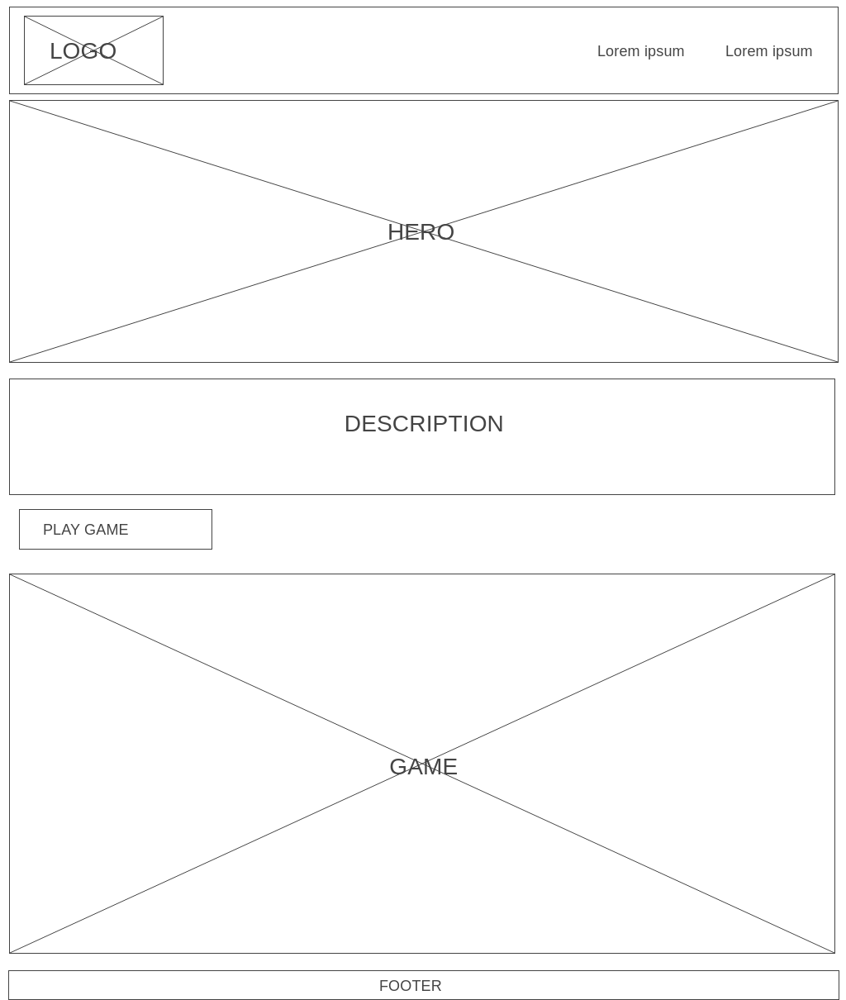

# Project-One
Star Wars: A New Trivia

General Assembly P1

Using Star Wars API, create a trivia game. Users will receive the value of a key value pair and have to give the key in order to receive points (ie: Green, 3ft tall Jedi Grandmaster = Yoda). At the end of the question set, players will receive a score and the option to play again.

